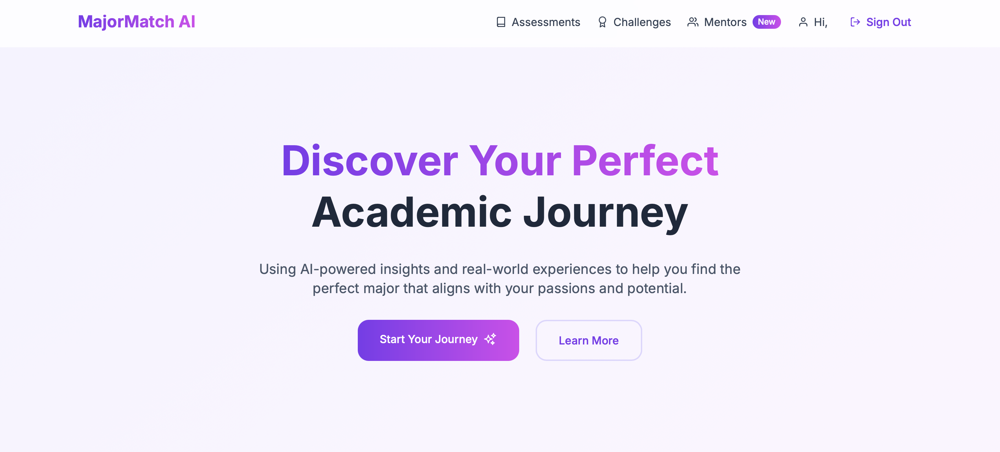
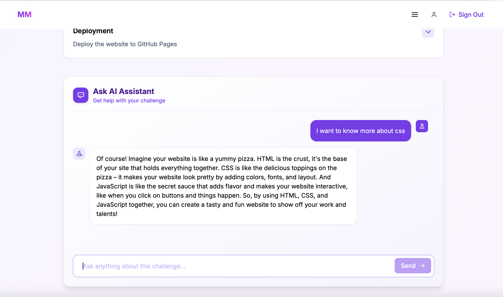
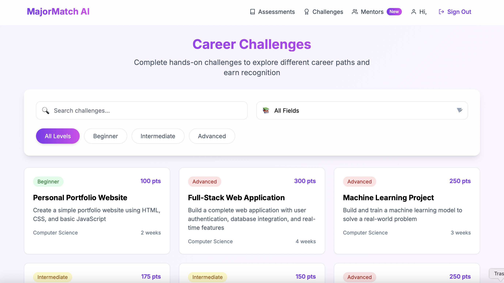
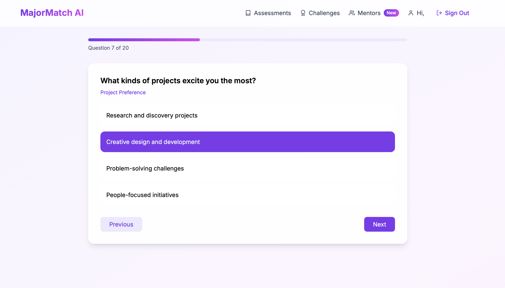
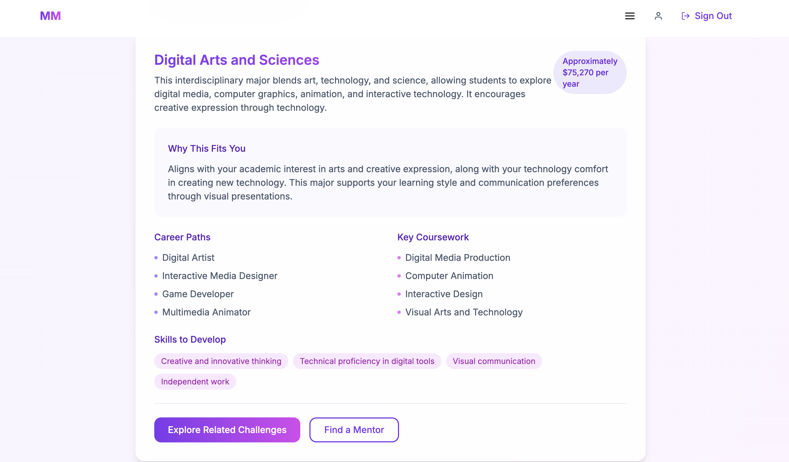
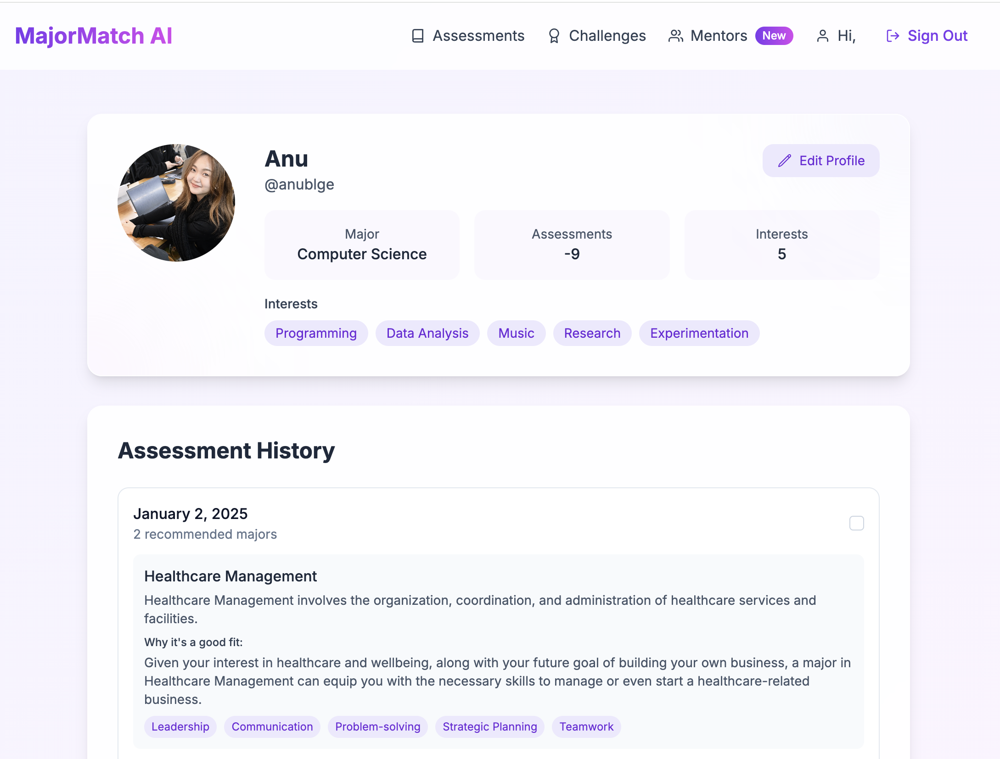

# MajorMatch AI 🎓✨

An intelligent career guidance platform that helps students discover their ideal academic path using AI-powered assessments, personalized mentorship, and interactive challenges.


## 🚀 Features

- **AI-Powered Assessments**: Leveraging GPT-4 for personalized major recommendations
- **Interactive Challenges**: Field-specific tasks to explore different careers
- **Mentor Matching**: Connect with professionals in your field of interest
- **Real-time Progress Tracking**: Monitor your journey with detailed analytics
- **Responsive Design**: Seamless experience across all devices

## 🛠 Tech Stack

<div align="center">
  
</div>

### Core Technologies

<table>
  <tr>
    <td align="center" width="96">
      
      <br>Flutter
    </td>
    <td align="center" width="96">
      
      <br>Next.js
    </td>
    <td align="center" width="96">
      
      <br>TypeScript
    </td>
    <td align="center" width="96">
      
      <br>JavaScript
    </td>
    <td align="center" width="96">
      
      <br>Python
    </td>
  </tr>
</table>

### Backend & Cloud

<table>
  <tr>
    <td align="center" width="96">
      
      <br>C++
    </td>
    <td align="center" width="96">
      
      <br>Firebase
    </td>
    <td align="center" width="96">
      
      <br>AWS
    </td>
  </tr>
</table>

### Frontend & AI

<table>
  <tr>
    <td align="center" width="96">
      
      <br>React
    </td>
    <td align="center" width="96">
      
      <br>Node.js
    </td>
    <td align="center" width="96">
      
      <br>TensorFlow
    </td>
  </tr>
</table>

## 🌟 Key Implementations

- **Custom Assessment Engine**: Built with OpenAI's GPT-4 for accurate career recommendations
- **Real-time Mentorship Platform**: Video calls and messaging system
- **Interactive Challenge System**: Progress tracking and achievement rewards
- **Profile Management**: Photo uploads and customization options
- **Responsive Dashboard**: Analytics and progress visualization

## 🚀 Getting Started

1. Clone the repository:
```bash
git clone https://github.com/yourusername/major-match-ai.git
```

2. Install dependencies:
```bash
cd major-match-ai
npm install
```

3. Set up environment variables:
```bash
cp .env.example .env
```

4. Start the development server:
```bash
npm run dev
```

## 📱 Screenshots

<div class="screenshot-grid" style="display: grid; grid-template-columns: repeat(3, 1fr); gap: 20px; margin: 40px 0; background: var(--bg-gradient); padding: 20px; border-radius: 16px;">
    <div style="border-radius: 12px; overflow: hidden; box-shadow: 0 4px 20px rgba(0,0,0,0.1); transition: transform 0.3s;">
        
    </div>
    <div style="border-radius: 12px; overflow: hidden; box-shadow: 0 4px 20px rgba(0,0,0,0.1); transition: transform 0.3s;">
        
    </div>
    <div style="border-radius: 12px; overflow: hidden; box-shadow: 0 4px 20px rgba(0,0,0,0.1); transition: transform 0.3s;">
        
    </div>
    <div style="border-radius: 12px; overflow: hidden; box-shadow: 0 4px 20px rgba(0,0,0,0.1); transition: transform 0.3s;">
        
    </div>
    <div style="border-radius: 12px; overflow: hidden; box-shadow: 0 4px 20px rgba(0,0,0,0.1); transition: transform 0.3s;">
        
    </div>
    <div style="border-radius: 12px; overflow: hidden; box-shadow: 0 4px 20px rgba(0,0,0,0.1); transition: transform 0.3s;">
        
    </div>
</div>

## 🎯 Future Enhancements

- [ ] AI-powered chat support
- [ ] Virtual career fairs
- [ ] Enhanced analytics dashboard
- [ ] Mobile app development
- [ ] Integration with job boards

## 🛡️ License

This project is licensed under the MIT License - see the [LICENSE](LICENSE) file for details.

## 🙋‍♂️ Author

**Anu**
- Portfolio: [anubilegdemberel.com](https://anubilegdemberel.com)
- LinkedIn: [linkedin.com/in/anubilegdemberel](https://www.linkedin.com/in/anu-bilegdemberel-445366318/)

---

<p align="center">Made with ❤️ and lots of ☕</p>